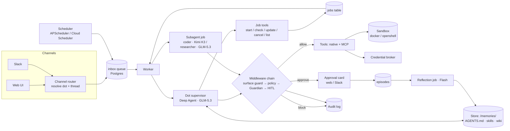

# Design: open dot runtime (`openai_dot_replica_v1.0`)

Audience: the engineer (and Claude Code) building v1. Read this first, then `docs/implementation-plan.md`.

Background research: `docs/reference/open-dots-blueprint.html` (teardown of OpenAI dots, model strategy, cost) and `docs/reference/openshell-and-dot-use-cases.html` (sandbox options, OpenShell, use-case fit).

---

## 1. What we are building

An open, self-hostable equivalent of OpenAI **dots** (launched 29 Sep 2026): always-on agents that each have their own computer, take work from several channels in **one continuous thread**, run background research with **read-only** access, learn from feedback, and put every consequential action behind **policy, an independent reviewer and human approval**.

The product is a harness, not a model. We build it on LangChain **Deep Agents** and open-source **LangGraph**, with open models on **Fireworks**.

**A dot = a pack + a thread + a computer.**

- **Pack:** declarative YAML (persona, skills, wiki, tools, policy, schedules, subagents). The same idea as the packs in `config_driven_deep_agents_v1`.
- **Thread:** one LangGraph thread for the life of the dot, shared by every channel.
- **Computer:** a sandbox behind the `execute` tool, created on demand and suspended when idle.

### Goals for v1

1. One dot per user, defined by a pack, reachable from a web UI and Slack in the same thread.
2. Long work runs as background jobs, so the dot keeps answering while it works.
3. A sandboxed computer through a pluggable backend: Docker locally, OpenShell locally and on GCP.
4. The safety layer: effect-tagged tools, a policy table, a Guardian reviewer, human approvals, an audit log, and credentials the model never sees.
5. Proactive sweeps on a schedule with a read-only capability profile, feeding a findings inbox.
6. A learning loop: episode capture, nightly reflection, and replay-gated edits to memory and skills.
7. Runs locally with `docker compose`, and deploys to GCP (Cloud Run + Cloud SQL + GCS).

### Non-goals for v1

- Voice calls, SMS and Teams (the channel adapter interface must allow them later).
- Pixel-level computer use. Prefer APIs and DOM; browser automation is a subagent added later.
- Multi-tenant SaaS billing. v1 is single-organisation and multi-user.
- LangSmith Deployment, LangGraph Agent Server or Managed Deep Agents at runtime. We own the runtime so it runs anywhere.

---

## 2. Decisions

Change these before starting, not during the build.

| Topic | Decision |
|---|---|
| Language / tooling | Python 3.12, `uv` workspace, ruff, mypy, pytest. Web: Next.js 16, React 19, TypeScript, Tailwind v4 |
| Harness | `deepagents` 0.7.x (pin exact) on `langgraph` 1.2.x, `langchain` 1.4.x |
| Runtime | Our own FastAPI API + worker over Postgres. No Agent Server |
| Persistence | Postgres 17 (pgvector image): LangGraph checkpointer, LangGraph `PostgresStore`, app tables |
| Models | Fireworks serverless. Supervisor `glm-5p3`; heavy work `kimi-k3`; Guardian, sweeps and reflection `glm-5p3-flash`. Behind a role-based model factory so OpenAI or Azure can be swapped per role |
| Sandbox | `RunSandbox(BaseSandbox)` seam (ported from recon v2). Backends: `docker` (default local), `openshell` (local and GCP). `cloudrun` and `gke` later |
| Channels v1 | Web UI and Slack (Socket Mode locally, Events API on GCP) |
| Connectors | MCP servers through `langchain-mcp-adapters`, plus native tools. Every tool must declare an effect |
| First pack | `research-analyst`: a generic dot that watches sources, researches, writes briefs and drafts messages. Easy to test end to end |
| Second pack | `onboarding-ops`: drives the recon workbench over its HTTP API (Phase 12) |
| Observability | OpenTelemetry traces and a Postgres audit log. LangSmith tracing optional in dev, off by default |
| Deployment | GCP: Cloud Run (`api`, `worker`, `web`), Cloud SQL, GCS, Secret Manager, Cloud Scheduler. OpenShell gateway on a GCE VM (Cloud Run cannot host its k3s-in-Docker gateway) |

---

## 3. Architecture



### 3.1 Processes

| Process | Role | Local | GCP |
|---|---|---|---|
| `api` | REST + SSE for the web UI, Slack events endpoint, approvals endpoint, scheduler webhook | uvicorn | Cloud Run service |
| `worker` | Consumes the inbox and jobs queues, runs agents | Python process | Cloud Run service, CPU always allocated, min instances 1 |
| `web` | Next.js UI | `pnpm dev` | Cloud Run service |
| `postgres` | Checkpoints, store, app tables | compose | Cloud SQL |
| sandbox | The dot's computer | Docker or OpenShell | OpenShell on a GCE VM; later GKE Agent Sandbox |

The `api` never runs an agent. It writes to the queue and streams events. This keeps Cloud Run request timeouts and scale-to-zero out of the agent's way.

### 3.2 Queues (Postgres, `FOR UPDATE SKIP LOCKED`)

- `inbox`: one row per inbound message or scheduled trigger: `dot_id, source (web|slack|schedule|job_result), payload, created_at, claimed_at, done_at`.
- `jobs`: one row per background job: `job_id, dot_id, subagent, instructions, status (queued|running|succeeded|failed|cancelled), thread_id, result_ref, updates[]`.
- **One active supervisor run per dot.** The worker takes a per-dot advisory lock. Messages that arrive mid-run are appended to the next turn, which gives the "enqueue" behaviour: nothing is dropped and nothing interleaves.

---

## 4. The dot

### 4.1 Pack format (`packs/<name>/pack.yaml`)

```yaml
name: research-analyst
persona: persona.md               # name, tone, standing goals
models: {supervisor: glm-5p3, heavy: kimi-k3, fast: glm-5p3-flash}
skills: skills/                   # method that would work at another company
wiki: wiki/                       # this organisation's context, seeded into the store
tools:
  native: [web_search, fetch_url, draft_email, send_email, slack_post, write_report]
  mcp: [github]                   # names from config/mcp.yaml
subagents:
  - {name: researcher, model: supervisor, tools: [web_search, fetch_url], description: "..."}
  - {name: coder, model: heavy, tools: [execute], sandbox: true, description: "..."}
profiles:                         # capability profile per entry point
  chat:     {tools: "*", subagents: "*"}
  sweep:    {effects: [read], subagents: [researcher]}
  digest:   {effects: [read, draft]}
policy: policy.yaml
schedules:
  - {name: sweep, cron: "*/30 7-22 * * 1-5", profile: sweep, prompt: "Run your sweep."}
  - {name: digest, cron: "45 8 * * 1-5", profile: digest, prompt: "Send the morning digest."}
```

A pack is validated by a pydantic model at load time. An unknown tool, an untagged tool or a profile that grants an effect the policy blocks fails the load.

### 4.2 Assembly

One `assembly.py` builds models, tools, middleware and agents for every surface and test (the pattern from recon v2). Per turn:

```python
agent = create_deep_agent(
    model=models("supervisor"),
    system_prompt=render_persona(pack),
    tools=registry.for_profile(profile),
    subagents=pack_subagents(pack, profile),  # synchronous, short tasks only
    memory=["/memories/AGENTS.md"],
    skills=["/memories/skills/"],
    backend=lambda rt: CompositeBackend(
        default=LazySandbox(sandbox_factory, dot_id),  # the dot's computer, started on first use
        routes={"/memories/": StoreBackend(rt), "/wiki/": StoreBackend(rt)},
    ),
    interrupt_on=policy.approval_map(),
    middleware=[
        SurfaceGuard(profile),
        PolicyMiddleware(policy),
        Guardian(models("fast")),
        Offload(...),
        Redaction(...),
        ModelRetry(...),
        ModelCallLimit(...),
    ],
    checkpointer=pg_checkpointer,
    store=pg_store,
)
```

Confirm `CompositeBackend` and `StoreBackend` constructor signatures against the pinned deepagents version before writing this.

### 4.3 Background jobs (our async subagents)

Deep Agents async subagents target Agent Protocol servers, which we don't run. We provide the same five tools over the `jobs` table so the semantics match and we can swap later:

| Tool | Behaviour |
|---|---|
| `start_job(subagent, instructions)` | Inserts a job, returns `job_id` at once |
| `check_job(job_id)` | Status, last update, result summary when done |
| `update_job(job_id, message)` | Appends an instruction the job reads at its next turn |
| `cancel_job(job_id)` | Marks cancelled; the worker stops at the next model or tool boundary |
| `list_jobs(status?)` | This dot's jobs |

A job runs as its own Deep Agent on its own thread with the subagent's tools, model and sandbox. On completion the worker posts a `job_result` row to the dot's inbox, so the dot tells the user in the channel the work came from.

### 4.4 Models (Fireworks)

| Role | Model id | Why |
|---|---|---|
| `supervisor` | `accounts/fireworks/models/glm-5p3` | Strong agentic ability per dollar; text-only |
| `heavy` | `accounts/fireworks/models/kimi-k3` | Long-horizon coding and documents; vision |
| `fast` | `accounts/fireworks/models/glm-5p3-flash` | Guardian, sweeps, triage, reflection drafts; vision |

Rules:

- The model factory returns a `BaseChatModel` per role from settings. Provider is `fireworks` (`ChatFireworks`) or `openai_compatible` (`ChatOpenAI` with `base_url`). One code path for all.
- **Reasoning round-trip is a gate.** Kimi K3 degrades if its reasoning history is dropped between tool turns, and an earlier `langchain-fireworks` bug dropped `reasoning_content`. A live test asserts it survives a three-tool loop before any agent work starts (task F2).
- Keep the prompt prefix stable (persona, tool schemas, AGENTS.md, skills index) so Fireworks prompt caching applies. Volatile content goes last.

---

## 5. Safety

The deterministic layers decide. The model reviewer can only add refusals, never grant.

### 5.1 Effect-tagged tools

Every tool is registered with one effect: `read`, `draft`, `write`, `external` (sends or publishes outside the org), `financial`, or `credential`. MCP tools get effects from `config/mcp.yaml`; an MCP tool without a mapping is not offered.

### 5.2 Policy (`policy.yaml`)

```yaml
defaults: {read: allow, draft: allow, write: approve, external: approve, financial: approve, credential: block}
tools:
  send_email: approve
  delete_*: block
approvers: [U123ABC]          # Slack / web user ids allowed to approve for this dot
```

- `allow` runs (after the Guardian for anything above `read`).
- `approve` pauses through LangGraph `interrupt` and renders an approval card.
- `block` returns a tool error that says it was blocked by policy.

### 5.3 Middleware order

1. `SurfaceGuard`: filters tools by the active capability profile and refuses calls to tools the model was not shown (port `InvocationGuardMiddleware` from recon v2).
2. `PolicyMiddleware`: applies `block`. `approve` tools are paused by `interrupt_on`.
3. `Guardian`: for effects above `read`, calls the `fast` model with structured output `{in_scope, risk, reason}`. Its input is the user's original instruction, the pending call and the dot's rules, **never tool output or fetched content**. It refuses when `in_scope` is false or `risk` is `high`.
4. Human approval on `approve` tools: approve, edit or reject from the web UI or Slack. The server checks the approver is in `approvers`.
5. Audit: every call, verdict and decision is written to `audit_log` (append-only).

### 5.4 Credentials

The model sees handles such as `cred:slack-bot`, never secrets. A `CredentialBroker` resolves handles inside tool code (from `.env` locally, Secret Manager on GCP). Sandboxes get no credentials. When a sandbox must reach an external API, it uses OpenShell provider placeholders and an L7 network policy (read-only by default).

### 5.5 Prompt injection posture

- Fetched and tool-returned content is wrapped as data, with a marker the persona tells the model to treat as untrusted.
- Research subagents have no `write`, `external` or `financial` tools.
- The Guardian never sees fetched content.
- A red-team suite runs in CI with a scripted model and live in the eval job (task E3).

---

## 6. Sandbox

Port `RunSandbox`, `LazySandbox` and `DockerSandbox` from `recon_knowledge_work_agent_v2/src/onboarding_agent/sandbox/`. They already implement Deep Agents' `BaseSandbox`, so the agent code is backend-agnostic.

| Backend | Use | Notes |
|---|---|---|
| `docker` | Local default, CI | `network none`, read-only root, tmpfs `/work`, `cap_drop ALL`, no env |
| `openshell` | Local, and GCP via a GCE VM gateway | Port exec and file calls from `langchain-ai/openshell-deepagent` (`openshell` PyPI SDK). Policy YAML per profile |
| `cloudrun` | Later: no-network code runs inside the API instance | Each `sandbox do` is fresh; carry `/work` as a tar |
| `gke` | Later: stateful gVisor sandboxes with warm pools | `k8s-agent-sandbox` client |

Layout inside every backend: `/work` writable, `/in` (inputs) read-only, `/skills` read-only. A dot's sandbox is keyed by `dot_id`, suspended after `SANDBOX_IDLE_S`, and restored from the image plus `/work` snapshot in object storage.

---

## 7. Proactivity

- The scheduler (APScheduler locally, Cloud Scheduler calling `POST /schedules/{dot}/{name}` on GCP) inserts an inbox row with the schedule's profile and prompt.
- Sweeps run the `sweep` profile: `read` effects only. This is enforced by `SurfaceGuard` and by credentials that are read-only at the source.
- A sweep writes findings to `findings` (`dot_id, title, evidence, score, status`). The next chat or digest turn decides whether anything is worth the user's attention. Sweeps never message the user directly.
- Budgets: each schedule has a model-call and token ceiling; exceeding it ends the run and logs a finding.

---

## 8. Memory and learning

| Layer | Where | Written by |
|---|---|---|
| Persona | pack `persona.md` | Humans |
| Skills (reusable method) | Store `/memories/skills/` seeded from the pack | Humans; reflection proposes edits |
| Wiki (this org's context) | Store `/wiki/` seeded from the pack | Humans and reflection |
| Preferences | Store `/memories/AGENTS.md` | Reflection |
| Episodes | `episodes` table | Automatically, on every approval, edit, rejection and correction |

**Reflection loop (nightly, per dot):**

1. Load the day's episodes.
2. The `fast` model drafts edits to `AGENTS.md`, the wiki and skills as unified diffs, each linked to the episode ids behind it.
3. **Replay gate:** re-run up to N stored episodes with the edited harness using the scripted comparison (did the proposal now match what the human did?). Keep an edit only if the match rate does not fall and at least one episode improves.
4. Commit accepted edits as a new `memory_version`, show the diff in the UI weekly, allow one-click rollback.

This is harness evolution without fine-tuning, the same approach as the RSI research programme.

---

## 9. Data model (Postgres)

```
dots(dot_id, owner_user_id, pack_name, pack_version, thread_id, created_at, status)
users(user_id, display_name, slack_user_id, web_subject)
inbox(id, dot_id, source, payload jsonb, profile, created_at, claimed_at, done_at, error)
jobs(job_id, dot_id, subagent, instructions, status, thread_id, updates jsonb, result_ref, created_at, finished_at)
approvals(approval_id, dot_id, run_ref, tool, args jsonb, status, decided_by, decided_at, edit jsonb)
audit_log(id, dot_id, at, actor, kind, tool, effect, decision, verdict jsonb, detail jsonb)   -- append-only
findings(id, dot_id, schedule, title, evidence jsonb, score, status, created_at)
episodes(id, dot_id, at, task, proposal jsonb, human_action, outcome jsonb)
memory_versions(id, dot_id, at, diff text, episodes int[], status)
channel_bindings(dot_id, channel, external_id)          -- e.g. Slack DM or channel id
```

LangGraph owns its own checkpoint and store tables.

---

## 10. Surfaces

- **Web UI:** dot home (thread, jobs, findings, approvals), approval cards with current and proposed values, audit viewer, memory diff viewer, sandbox activity log. SSE for live events.
- **Slack:** DM or mention goes to the dot's inbox; replies post in the same thread; approval cards are Block Kit with approve, edit and reject; the server checks the Slack user id is an approver.
- **CLI:** `dot run <pack> "<message>"`, `dot jobs`, `dot approve <id>`, `dot reflect <dot>`, for tests and demos.

---

## 11. Deployment on GCP

| Component | Service |
|---|---|
| `api`, `web` | Cloud Run services |
| `worker` | Cloud Run service, CPU always allocated, min 1, concurrency matched to per-dot locks |
| Postgres | Cloud SQL for PostgreSQL 17 with pgvector |
| Objects | GCS (inputs, reports, `/work` snapshots) |
| Secrets | Secret Manager, read by `CredentialBroker` |
| Schedules | Cloud Scheduler → `api` with OIDC auth |
| Sandbox | OpenShell gateway on a GCE VM (Container-Optimized OS or Ubuntu with Docker), reached over private VPC |
| Identity | IAP or Identity Platform in front of `web` and `api`; Workload Identity for service accounts |
| IaC | Terraform in `infra/` |

---

## 12. Cost guardrails

- Per-dot monthly token budget and per-run model-call limit (`ModelCallLimitMiddleware`).
- Sweeps run in working hours by default.
- Suspend idle sandboxes.
- The `/dots/{id}/usage` endpoint reports tokens by role and model, using Fireworks list prices from config.

Indicative figure from the research: a heavily used dot on GLM-5.3 with Kimi K3 for the hardest quarter of tasks costs about $200–230 a month in inference, before sandbox compute.

---

## 13. Risks

| Risk | Mitigation |
|---|---|
| Open models drift out of scope on long runs | Deterministic policy first, Guardian second, drafts by default, per-model prompt tuning, live eval |
| Prompt injection through fetched content | Guardian never sees it; research subagents have no side-effect tools; red-team suite |
| OpenShell is alpha | Docker stays the default; OpenShell behind the same seam with contract tests |
| Reasoning content dropped by the Fireworks integration | Gate test in F2; fall back to `ChatOpenAI` against Fireworks' OpenAI-compatible endpoint with reasoning passthrough |
| Cloud Run request limits | Agents run in the worker, never in request handlers |
| Memory edits that make things worse | Replay gate, versioning and rollback |
